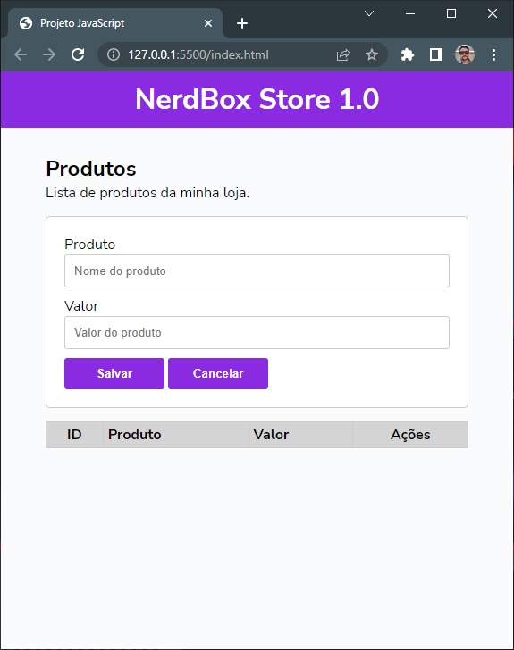
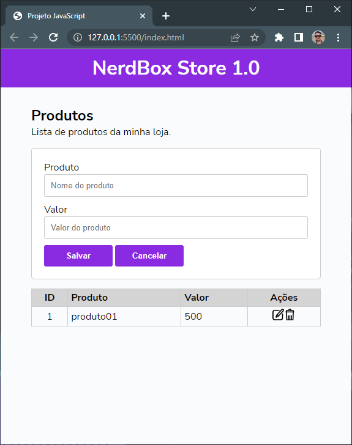
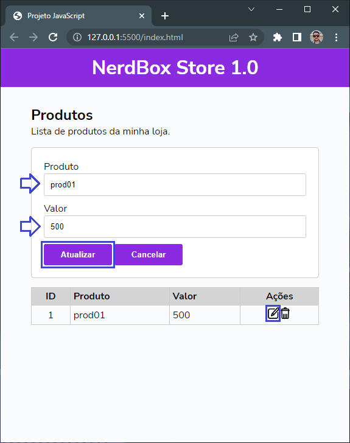
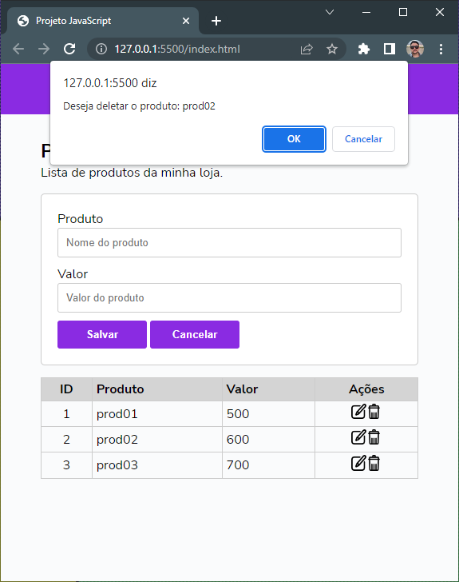
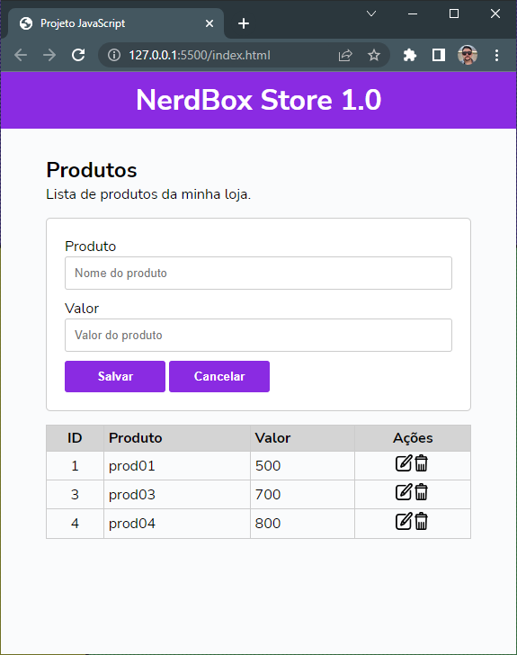

# Formulário de cadastro de produtos

## POO no JavaScript by [Programador Espartano](https://programadorespartano.com.br/)
Este projeto foi feito seguindo um tutorial no [YouTube](https://www.youtube.com/watch?v=6Q2zZiuJPF4&t=0s).  
De maneira dinâmica conseguimos cadastrar o produto e já visualizá-lo na mesma página.  
Opções de editar e excluir são criados a cada linha do item.  
O software utiliza da memória local da máquina para realizar as operações, impedindo de migrar seus dados para outra máquina.  

## Confira do app já on-line
http://nerdbox-store.vercel.app/

## Recursos Utilizados
- HTML5
- CSS3
- JavaScript (vanila)
  - Classes
  - lógica de programação
- Versionamento
- Deploy com Vercel.app

<h2>Screenshots</h2> 
<div style="text-align: center;>
  <h3> Aplicativo aberto</h3>
  

  <h3> Primeiro Item Cadastrado</h3>
  

  <h3> Item Sendo Alterado</h3>
  

  <h3> Item Sendo Excluído (confirmação da exclusão)</h3>
  

  <h3> Item excluído da lista</h3>
  
</div>


## Clone
 Para fazer o clone do repositório e contribuir com seus conhecimentos: 
```bash
git clone https://github.com/huannvictor/POO-na-pratica.git
``` 

## Implementações futuras
- Área onde apresente os valores totais (quantidade de itens e valor total do preço)
- Salvar as informações em nuvem